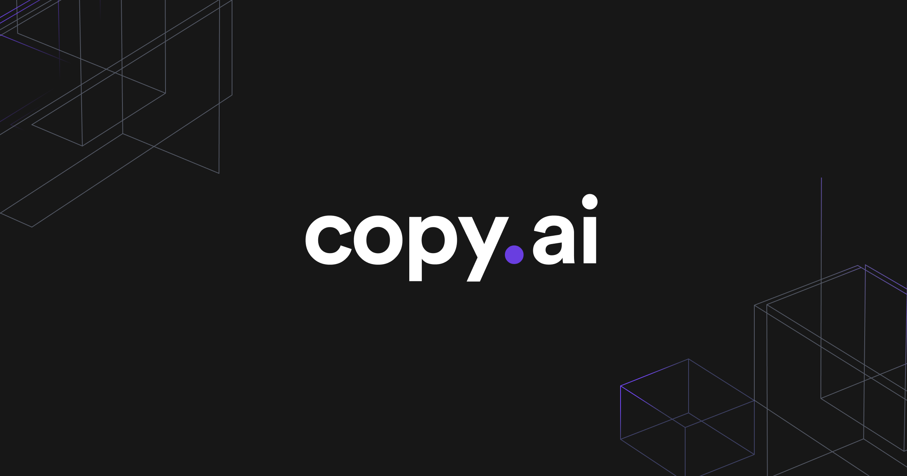

# copy.ai Case Study

## Table of contents
- [Overview and Origin](#-overview-and-origin)
- [Business Activities](#-business-activities)
- [Landscape](#-landscape)
- [Results](#-results)
- [Recommendations](#-recommendations)
- [References](#-references)

## Overview and Origin

**copy.ai** was incorporated November 1st 2020 by Paul Yacoubian and Chris Lu.[1][1]

 

copy.ai originated from an AI tagline generator called tagline.ai, which was solely focused on creating taglines. After the product gained popularity, the co-founders decided to rebrand and expand it into Copy.ai, transforming it into a versatile platform with a suite of tools designed for a broader range of use cases and greater flexibility in the go-to-market sector.[2][2]

As of August 2024, the company has had two rounds of funding totaling approximately 14 million dollars. The latest round of funding, October 2021, was a round of series A funding worth 11 million dollars.[1][1]

 [1]: https://tracxn.com/d/companies/copyai/__CpgkaxmsjdcVRbL_T_FZy8jzVEoLTZkeZIUaHOWyN5c

 [2]: https://www.youtube.com/watch?v=sPdNd3bExTo&t=287s

## Business Activities

>Growth or profitability?
>
>For years, operators have been led to believe these two critical business objectives are mutually exclusive. Conventional wisdom dictated that pursuing growth meant burning cash to acquire customers at all costs.
>
>While chasing profitability required austerity measures that stifled innovation and stagnated revenue growth.
>
>But what if I told you this is a false choice - a myth perpetuated by legacy technology limitations? Advances in artificial intelligence are now making it possible to have your cake and eat it too.[3][3]

[3]: https://www.copy.ai/blog/introducing-gtm-ai

**copy.ai** seeks to disrupt the marking sector by tackling two major problems:

- Software bloat.
- Consistent and quick content generation.

The marketing software sector is valued at nearly *300 billion dollars*.[4][4] While go-to-market planning and execution accounts for only a portion of that market share, it's manifest that the market touches a huge amount of people and potential customers.

[4]: https://www.inkwoodresearch.com/reports/digital-marketing-software-market/#:~:text=MARKET%20OVERVIEW,forecast%20period%2C%202023%2D2032.

**copy.ai** stands out from other GTM solutions by utilizing AI to streamline and simplify content generation for marketing teams. 

Imagine the typical process: 
- Marketing wants to launch a new initiative.
- A team creates the marketing content with a set of content creation tools. 
- Another team analyses the target audience and suggests how and where to advertise using a set of tools specific to that task.
- A final team uses a final set of tools to record user engagement and generate reports for ROI.

With **copy.ai**, the platform acts as a one-stop shop for content generation, analysis, and engagement reports. This removes the software bloat and helps free up labor to create more initiatives at a faster rate.

**copy.ai** Currently uses GPT Tools[5][5] to generate content. In addition, they use those tools provide a web-scrapping AI assistant to provide targeted company research.[6][6]

[5]: https://stackshare.io/copy-ai

[6]: https://www.copy.ai/guides/streamline-company-research-with-copy-ai

## Landscape

The marketing software landscape has seen massive growth as potential customers' online foot-print has grown larger. Between 2022 and 2023 the market cap nearly tripled and is expected to see a CAGR of 14.25% over the next 10 years.[4][4]

The software continues to get better. Cloud based platforms were the first step in streamlining the applications. Now many companies, including competitors like Hubspot, Cognism, and Kaspyr are looking to utilize AI to handle larger datasets and simplify usage.

## Results

**copy.ai** is still a startup. So far, their main funding mechanism comes from investors however they have several large customers using their product.[7][7] 

Currently, **open.ai** is ranked number 1 on a company profiler.[1][1] This could be due to a lack of competitors, however that is a sign that what they offer is unique for now.

[7]: https://www.copy.ai/use-cases/seo-content-creation

## Recommendations

Something I would be excited to see from **copy.ai** would be the inclusion of AI generated video materials for marketing campaigns.

The company would need to utilize NLP technologies[8][8] in order to achive this goal which would be a step away from the transformer neural networks they are currently utilizing. However, the value add from video content for their customers would set them far above any current or potential competition.

[8]: https://www.colossyan.com/posts/ai-video-generation-what-is-it-and-how-does-it-work#:~:text=AI%20video%20generators%20use%20machine,between%20human%20language%20and%20computers.

## References
 
 [1 - Company Profile](https://tracxn.com/d/companies/copyai/__CpgkaxmsjdcVRbL_T_FZy8jzVEoLTZkeZIUaHOWyN5c)

 [2 - Copy.ai Founder Reveals His SECRETS to AI Startup Success | Founder Chat w/ Paul Yacoubian](https://www.youtube.com/watch?v=sPdNd3bExTo&t=287s)

 [3 - Introducing GTM AI: How to Go from GTM Bloat to Velocity](https://www.copy.ai/blog/introducing-gtm-ai)

 [4 - GLOBAL DIGITAL MARKETING SOFTWARE MARKET FORECAST 2023-2032](https://www.inkwoodresearch.com/reports/digital-marketing-software-market/#:~:text=MARKET%20OVERVIEW,forecast%20period%2C%202023%2D2032.)

 [5 - Stackshare Copy.ai](https://stackshare.io/copy-ai)

 [6 - Streamline Company Research with Copy.ai](https://www.copy.ai/guides/streamline-company-research-with-copy-ai)

 [7 - copy.ai use cases.](https://www.copy.ai/use-cases/seo-content-creation)

 [8 - AI Video Generation: What Is It and How Does It Work?](https://www.colossyan.com/posts/ai-video-generation-what-is-it-and-how-does-it-work#:~:text=AI%20video%20generators%20use%20machine,between%20human%20language%20and%20computers.)
 
 [Paul Yacoubian LinkedIn Profile](https://www.linkedin.com/in/paulyacoubian/)
 
 [Chris Lu LinkedIn Profile](https://www.linkedin.com/in/chris-lu11/)

 [Banner Location](https://www.copy.ai/search)